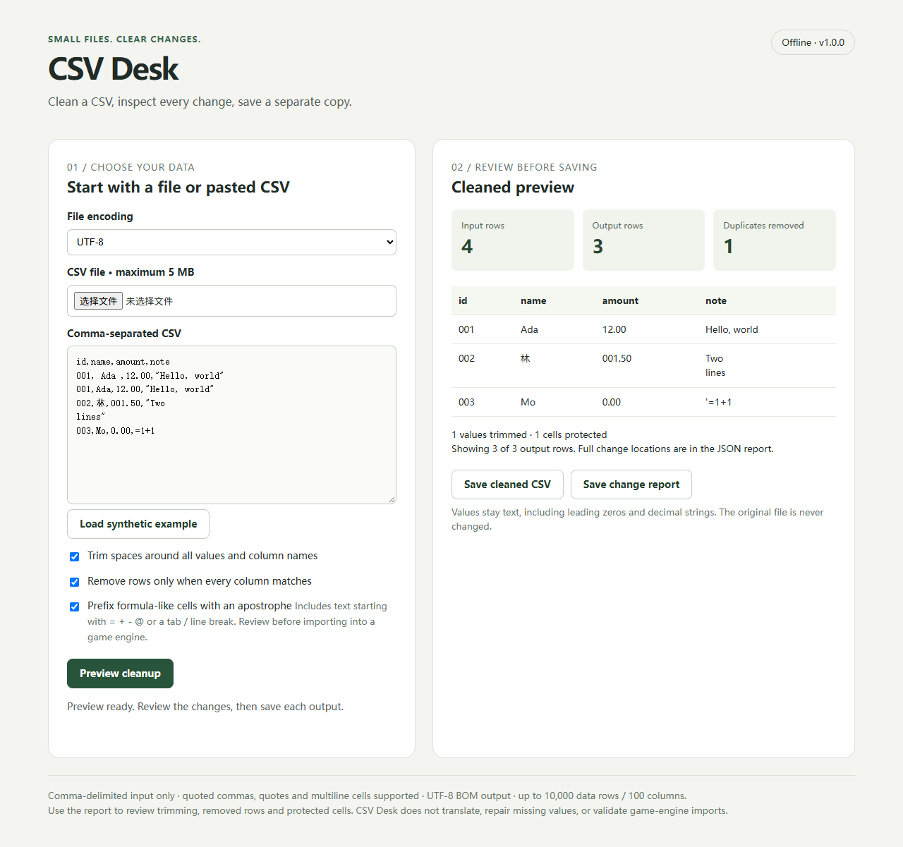
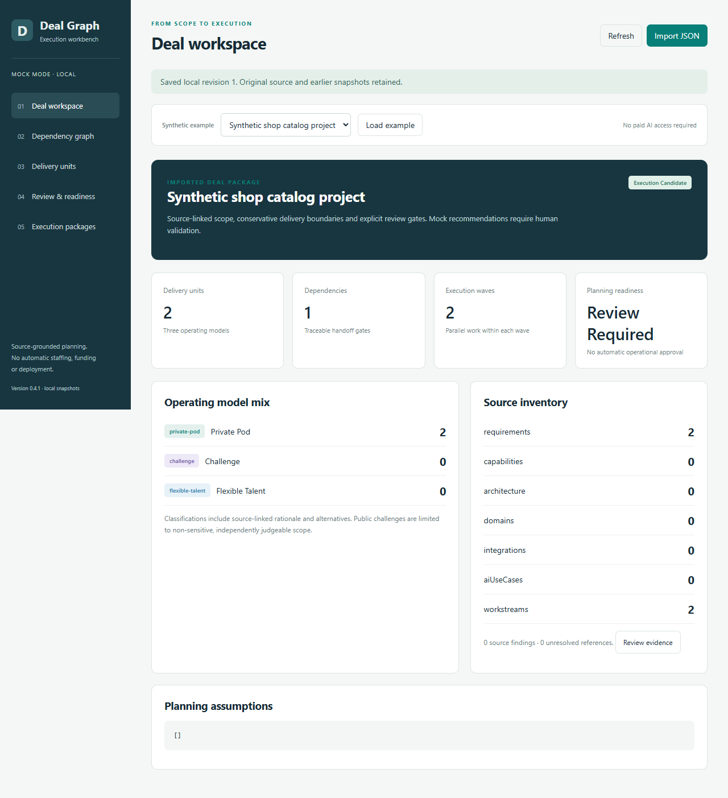

# Small CSV cleanup — checked output and a reusable script

Browse all current offers and Chinese entry points at [JoySky Tools](https://joysky77.github.io/).

Have a CSV export with stray spaces, duplicate records or broken Chinese characters? A small, fixed-scope cleanup can include the cleaned file, a reproducible Python script and a before/after report.

**US$25 proposed fixed price:** one CSV, up to 20,000 rows and 20 columns, UTF-8 or GB18030 input, surrounding whitespace cleanup and an agreed duplicate rule. One correction within the agreed scope is included. File-specific scope and turnaround are confirmed before accepting an order.

The demonstration uses fictional records. It preserves leading-zero identifiers, quoted commas, Chinese text and separate orders belonging to the same customer. Spreadsheet formula-like cells become inert text. It refuses to overwrite source or output files.

The included demonstration implements exact duplicates across all columns. A different duplicate key needs an agreed specification and verification; it is not automatically implemented by this sample.

## Free standalone CSV encoding checker

[Download the versioned HTML file](https://github.com/joysky77/csv-cleanup-services/releases/download/encoding-checker-v1.0.0/CSV-Encoding-Checker-v1.0.0.html) or [run the web version](https://joysky77.github.io/csv-cleanup-services/csv-encoding-checker.html). It checks a CSV sample locally for strict UTF-8 or GB18030 decoding and previews Chinese text without uploading the selected file. The free checker diagnoses encoding only; CSV Desk adds cleanup and export.

Optional support for the public tools is available through the repository Sponsor button. Sponsorship is not a product purchase, service order or proof of income.

Need to count repeated records first? [Download the fixed version 1.0.0 HTML file](https://github.com/joysky77/csv-cleanup-services/releases/download/duplicate-checker-v1.0.0/CSV-Duplicate-Row-Checker-v1.0.0.html) or [run the free local CSV duplicate-row checker](https://joysky77.github.io/csv-cleanup-services/csv-duplicate-checker.html). It reports exact duplicate data-record numbers without uploading or changing the file.

Need to review formula-like cells before opening a CSV in a spreadsheet? [Download the fixed version 1.1.0 HTML file](https://github.com/joysky77/csv-cleanup-services/releases/download/formula-risk-checker-v1.1.0/CSV-Formula-Risk-Checker-v1.1.0.html) or [run the free local formula-risk checker](https://joysky77.github.io/csv-cleanup-services/csv-formula-risk-checker.html). It reports conservative locations and previews without uploading, executing formulas or changing the source file.

Read the source-linked [CSV formula injection prevention guide](https://joysky77.github.io/csv-cleanup-services/prevent-csv-formula-injection.html) or its [中文说明](https://joysky77.github.io/csv-cleanup-services/csv-formula-injection-prevention-zh.html) for a practical review checklist, mitigation limits and links to OWASP and MITRE CWE-1236.

## Fixed USD 12 formula-safety service

Need a repaired copy rather than a report? The [CSV Formula Safety Fix](https://joysky77.github.io/csv-cleanup-services/csv-formula-safety-service.html) is a fixed USD 12 service for one comma-delimited CSV up to 5 MB, 10,000 data records and 100 columns. It supports UTF-8 and GB18030 input and delivers a separate UTF-8 BOM CSV plus a JSON audit report. The source is never overwritten.

[Open a scope request](https://github.com/joysky77/csv-cleanup-services/issues/new?template=formula-safety-request.yml) using fictional examples only. Do not post real customer records, private files, credentials or payment details. Scope is reviewed before payment; PayPal instructions are provided only after acceptance. CSV only, with no XLSX, macro analysis or absolute security guarantee.

中文：固定价格12美元，处理一个符合上述上限的逗号分隔CSV，交付独立修复副本和JSON审计报告。公开询问只用虚构样例，确认范围后才安排私下传输和PayPal付款。

## Request a quote

[Review the full US$25 scope](https://joysky77.github.io/csv-cleanup-services/csv-cleanup-service.html) or [open the short purchase inquiry form](https://github.com/joysky77/csv-cleanup-services/issues/new?template=quote-request.yml).

Open an issue with the approximate row/column counts, input encoding if known, desired transformation, duplicate rule and deadline. Use fictional examples only in public issues. Do not upload private customer files, credentials or payment details. Private sample exchange and data handling must be agreed separately.

No payment is requested before scope and acceptance criteria are agreed. Direct orders may use PayPal after acceptance; orders originating on a marketplace follow that marketplace's payment rules. A proposal or demo is not an order or proof of earnings.

Delivery uses AI-assisted development and reproducible checks. There are no claims of previous client work or independent human technical review.

## Run the demonstration

Python 3.13 was used for the local verification. No third-party package or network request is needed.

```text
python csv_cleanup_v1.py demo_input.csv cleaned_new.csv
```

Use a new output name. The command creates the CSV and its `.report.json` audit report. For GB18030 input, add `--encoding gb18030`. Keep a copy of the original input. Do not run this sample on confidential records until data handling is agreed.

Local verification passed for BOM/Chinese text, quoted commas, duplicate counts, separate orders, inert formulas, malformed-row rejection and refusal to overwrite existing files. This is a prepared demonstration, not a production certification.

---

## 中文服务说明

拟报价25美元：整理一份CSV导出表，最多2万行、20列；按事先确认的规则去空格、检查重复，保留编号前导零和中文，交付结果、运行脚本和变更报告，包含一次约定范围内的修正。

现有演示只删除全字段完全一致的重复行。按订单号等业务字段判重，需要先确认规则，不能直接按姓名删除记录。金额保留原文本，不猜测日期或金额含义。

公开询价请只提供行列数量、问题说明、输出要求和虚构样例。不要上传客户资料或收款信息。需求、验收条件和交付时间确认后才接受订单；当前没有已成交客户。


## Fixed-scope paid intake

A separate [US$29 small-CSV offer](https://moltgate.com/yangy0077/clean-one-small-csv-and-explain-every-change/) is now available through Moltgate: at most 25 data rows, 10 columns and a 2,000-character plain-text request. Use fictional or redacted data. It includes the cleaned CSV, a change report and an explanation; delivery is within 3 business days after complete in-scope input, with one correction requested within 7 days. Read the published scope before checkout. Moltgate processes the buyer payment; this listing has no confirmed sales yet.

另有[29美元小型CSV整理入口](https://moltgate.com/yangy0077/clean-one-small-csv-and-explain-every-change/)：最多25条数据行、10列，整条纯文本请求不超过2000字符。只提交虚构或脱敏数据，范围与交付条件以该页面为准。此服务已发布，尚无已确认成交。


---

## CSV Desk — $9 offline tool



[CSV Desk 1.0.0](https://joysky7777.itch.io/csv-desk) cleans a small comma-delimited CSV locally in Microsoft Edge without uploading the data. It trims surrounding whitespace, removes exact duplicate rows, optionally makes formula-like cells inert, preserves identifiers as text, previews the cleaned result, and exports a separate UTF-8 BOM CSV plus a JSON change report.

The download includes one standalone HTML tool, a synthetic example, instructions, and an internal-use license. Limits are 5 MB, 10,000 data records and 100 columns. It does not process XLSX files or provide custom cleanup work. Code and documentation were AI-generated and browser-tested; no independent human review is claimed.

Price: USD 9 through itch.io. PayPal checkout is available on the public product page. Platform refund rules and mandatory consumer rights apply.

[Buy CSV Desk for USD 9](https://joysky7777.itch.io/csv-desk/purchase) or [review the browser-verified product page](https://joysky77.github.io/csv-cleanup-services/).
---

### Delivery Workbench — $19 download

Turn a structured software-project brief into a source-linked delivery graph on your own computer. Inspect dependencies, edit work units, review planning blockers, and export JSON or Markdown.

Includes Python source, a synthetic example, a setup guide, and internal commercial-use rights. Requires Python 3.10+ and a modern browser. No paid AI account or cloud hosting is needed. Rule-based recommendations require review; arbitrary documents are not automatically understood. The input format and naming rules are documented in the supplied example and README. AI assisted development is disclosed.

Price: USD 19 for version 0.4.1. No subscription. Includes one setup troubleshooting exchange within seven days of delivery. Custom conversion, consulting and future upgrades are not included.

[Review the full product scope](https://joysky77.github.io/csv-cleanup-services/delivery-workbench.html) or [open a purchase inquiry](https://github.com/joysky77/csv-cleanup-services/issues/new?template=delivery-workbench.yml).

Before paying, email yangy0077@gmail.com with “Delivery Workbench inquiry” and your operating system. We will confirm compatibility, usage terms, payment instructions, and delivery arrangements. Please send no confidential project files. Payment is requested only after the order is agreed. Delivery uses the account owner's existing PayPal account and is confirmed by actual payment, not by screenshots supplied by a buyer.

Download is delivered after payment verification. This is an independent local planning tool; it does not approve staffing, funding, procurement or deployment, and is not endorsed by an external platform.


